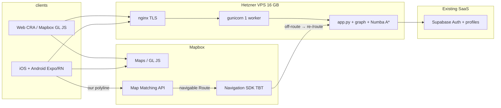

# Production hosting, Mapbox map, and mobile turn-by-turn

**Status:** Planning (14 Jul 2026) — not implemented  
**Product rule:** Tuned / Flask owns the route geometry. Mapbox provides map chrome and turn-by-turn guidance along **our** path (bring-your-own-route), not Mapbox cycling Directions as the planner.

**Related:** [`APP_MAIN.md`](APP_MAIN.md) · [`startup.md`](startup.md) · [`ROUTING_CACHE.md`](ROUTING_CACHE.md) · [`testing/startup_ram_report.md`](testing/startup_ram_report.md)

---

## 1. Architecture (target)



| Concern | Owner |
|---------|--------|
| Profile weights, A*, overlays, vias, live disruptions | Flask on Hetzner |
| Auth / profiles | Supabase (via Flask) |
| Basemap style, camera, locational UX | Mapbox Maps |
| Voice + banner turn-by-turn along Tuned path | Mapbox Navigation SDK + Map Matching |
| Geocode / Search Box | Flask proxy (already); mobile may use Maps Search with secret token |

---

## 2. Phase map

| Phase | Outcome | Depends on |
|-------|---------|------------|
| **P0 — Host API** | 24/7 Flask behind TLS | Graph + routing cache on disk |
| **P1 — Web Mapbox GL** | Replace Leaflet basemap; keep Flask routes | P0 optional but CORS/API_BASE needed for non-local |
| **P2 — Mobile shell** | Store-ready Expo/RN app: plan + draw Tuned polylines on Mapbox Maps | P0 |
| **P3 — TBT BYOR** | Start guidance on Tuned geometry; voice instructions | P2 + Map Matching |
| **P4 — Reroute** | Off-route → Flask `/route` (or snap + partial) → rematch → `updateRoute` | P3 |

Do **not** start P3 until P0 is stable: navigation without a always-on API is a dead end.

---

## 3. Phase P0 — Backend production (Hetzner)

### Fit (measured 13 Jul)

| Metric | Value |
|--------|--------|
| Peak RSS (startup) | ~8 GB |
| Idle RSS (v2 cache) | ~3.5–6 GB |
| Ready (cache hit) | ~2.5 min (live off) / ~3.8 min (live on, ops note) |
| Disk (gpickle + routing_cache) | ~3 GB |

**Box:** Hetzner **CX43** (8 vCPU / **16 GB** / 160 GB), EU (FSN or HEL). Prefer **x86** over ARM (Numba). One routing process only — do not scale workers horizontally without another 16 GB machine.

### Must-change before public

| Item | Today | Production |
|------|--------|------------|
| Server | `app.run(debug=True)` | gunicorn/waitress + nginx/Caddy TLS |
| `API_BASE` | hardcoded `http://127.0.0.1:5000` | `REACT_APP_API_BASE=https://api.…` |
| CORS | open `CORS(app)` | lock to web + app origins |
| Test mode | `ALLOW_TEST_MODE` | `0` (localhost-only anyway) |
| `/admin/*` | unauthenticated | secret / IP allowlist / local cron only |
| Data | local `1_data/` | ship gpickle + `*.routing_cache/` (prebuilt) |
| Process | manual | systemd, long `TimeoutStartSec`, health after ready |
| Swap | — | 2–4 GB safety net |

Frontend can stay on Cloudflare Pages / Netlify **or** same nginx static root.

### Hosting sequence

1. Provision CX43, Ubuntu, swap, firewall (80/443 only public).  
2. Python 3.11+, deps from `requirements.txt`, place graph + cache.  
3. systemd unit → gunicorn `app:app` (1 worker, high timeout).  
4. nginx TLS (Let’s Encrypt) → proxy.  
5. Env: Supabase, Mapbox, TfL, TomTom, ORS; `ALLOW_TEST_MODE=0`.  
6. Smoke `/route`, live refresh cron if admins locked down.  
7. Point frontend `API_BASE` at API URL.

---

## 4. Phase P1 — Web basemap: Leaflet → Mapbox GL JS

### Why switch

| | Leaflet + OSM (now) | Mapbox GL JS |
|--|---------------------|--------------|
| Cost | Free | Free tier then paid |
| Look / feel | Fine | Vector styles, smoother zoom, brandable night mode |
| Routing | Unchanged (Flask) | Unchanged |

**User-facing product delta:** polish, not path quality.  
**Engineering:** rewrite map surface (`react-leaflet` → `mapbox-gl` / `react-map-gl`): MapContainer, TileLayer, Polylines, Markers, `MapFlyTo`, Santander layer, overlays.

**Rule:** Use GL JS (bill **map loads**). Do **not** feed Mapbox tiles through Leaflet (tile request billing).

### Free tier (web) — [mapbox.com/pricing](https://www.mapbox.com/pricing)

| SKU | Free / month | Then (order of) |
|-----|--------------|-----------------|
| Mapbox GL JS map loads | **50,000** | ~$5 / 1k |
| Temporary Geocoding | **100,000** | ~$0.75 / 1k |
| Directions (if used) | **100,000** | ~$2 / 1k |
| Map Matching (BYOR) | ~**100,000** | similar to Directions |

One map load ≈ one `Map` init; pan/zoom free within session (max ~12 h).

Tokens stay server-side / URL-restricted; web bundle must not embed secret tokens (already the auth/geocode model).

---

## 5. Phase P2–P4 — Proper iOS + Android with Tuned TBT

### Stack choice

| Option | Verdict |
|--------|---------|
| Capacitor around current SPA | Fast “app shell”; **not** Mapbox Navigation |
| **Expo / React Native + Mapbox Maps + Navigation** | Right path for store + real TBT |
| Full native Swift/Kotlin | Best SDK fidelity; highest cost |

Mapbox Navigation is **native**. There is **no** official RN Navigation SDK — use a maintained Expo/community bridge or a thin native module. Budget time for iOS certificates, Play signing, TestFlight, privacy labels.

**“Couple of days with AI” is not realistic** for store-ready BYOR nav. Rough order: P0 days–week; P1 several days; P2 ~1–2 weeks; P3–P4 another 1–2+ weeks (reroute hardest).

### Product rule — bring your own route (BYOR)

```
User picks start/end (+ vias) + profile
        │
        ▼
Flask GET /route  →  Tuned polylines (fastest + optimized)
        │
        ▼
App shows preview on Mapbox Maps (our GeoJSON/coords)
        │  user taps Navigate
        ▼
Map Matching API  (cycling profile, subsampled coords from Tuned path)
        │
        ▼
Navigation SDK active guidance (voice, banners, puck)
        │  if off-route
        ▼
Flask re-route from GPS (+ remaining vias) → rematch → updateRoute
```

**Do not** call Mapbox Directions as the primary planner — that discards Tuned weights. Directions may still exist for experiments or walk legs; not the cycle path authority.

### Map Matching notes

- Subsample dense `/route` coordinates to stay within Map Matching point limits; keep shape fidelity.  
- Use cycling profile / navigation match options so the SDK returns a navigable `Route`.  
- Map Matching snaps to **Mapbox’s** network — rare local divergences vs OSM-derived Tuned path; monitor London edge cases (parks, tracks).  
- Default SDK off-route behaviour may fall back to Mapbox Directions — **disable / override** so rebuild always goes through Flask + rematch.

### Mobile Mapbox free tiers (order of)

| SKU | Free / month | Notes |
|-----|--------------|--------|
| Maps SDK mobile | **25,000 MAUs** | Then ~$4 / 1k |
| Navigation SDK v3 Metered | **100 MAUs + 1,000 trips** | Then ~$0.30/MAU + ~$0.08/trip |
| Navigation Unlimited trips | **10 MAUs** free | Then sales |

Early launch: maps free tier is comfortable; **Navigation free tier is tight** once people ride with guidance.

### App surface (MVP)

1. Auth (same Flask `/auth/*` + session).  
2. Profiles / Test Mode parity (Test Mode off in prod builds).  
3. Start / end / vias + Get Route.  
4. Draw Tuned legs; pick fastest vs optimized; optional overlays subset.  
5. **Navigate** → BYOR TBT.  
6. End ride / cancel; optional stats reuse.

Defer: full overlay chrome parity, Depart-at complexity, Santander inside nav session (can stay web-first).

---

## 6. Decisions locked (planning)

| Decision | Choice |
|----------|--------|
| Route authority | **Tuned Flask** |
| Guidance | **Mapbox Navigation** via Map Matching BYOR |
| Basemap (target) | **Mapbox** (web GL JS + mobile Maps SDK) |
| Hosting | **Hetzner ~16 GB** unmanaged VPS |
| Mobile framework | **Expo / React Native** (not Capacitor-only for TBT) |
| Horizontal API scale | Single process first; second VPS = second full graph |

---

## 7. Open questions

- Exact Map Matching max points + preferred downsample strategy for London routes.  
- Whether `/route` gains a `navigate=1` (or separate) response with already-subsampled coords + bearing hints.  
- Off-route: full re-`/route` vs map-snap to corridor + local repair.  
- Apple/Google developer accounts, privacy policy URL, background location copy.  
- Web Mapbox public token URL restrictions vs mobile secret token storage.  
- Keep Leaflet longer on web if P0/P2 are higher priority than P1 polish.

---

## 8. Suggested checklist (copy into sprint)

**P0**
- [ ] Hetzner CX43 + systemd gunicorn + nginx TLS  
- [ ] Deploy gpickle + routing_cache v2  
- [ ] Env hardened; CORS; admin lock; `API_BASE` env  
- [ ] Smoke long hop + live refresh  

**P1**
- [ ] `react-map-gl` / Mapbox GL map module  
- [ ] Port polylines, markers, fly-to, overlays  
- [ ] Style (day/night) in Mapbox Studio  

**P2**
- [ ] Expo app skeleton + HTTPS API client  
- [ ] Auth + profiles + route preview on Maps SDK  

**P3**
- [ ] Subsample + Map Matching → Navigation view  
- [ ] Cycling BYOR only (no Mapbox Directions planner)  

**P4**
- [ ] Off-route → Flask → rematch → updateRoute  
- [ ] TestFlight + Play internal track  

---

## 9. Doc / codebase touchpoints (when implementing)

| Area | Paths |
|------|--------|
| API client | `5_frontend/src/api/flaskClient.js` (`API_BASE`) |
| Map UI | `5_frontend/src/App.js`, `MapFlyTo.js`, overlay / Santander layers |
| Backend serve | `4_backend_engine/app.py` (`app.run`, CORS, `/admin`) |
| New (future) | `6_mobile/` or `apps/mobile/` Expo project; optional `/route` navigate helpers |
| Secrets | `4_backend_engine/.env` — Mapbox public + secret tokens; never CRA `REACT_APP_*` secrets |
