> **Notice:** This project is in active development. The planner below is the shipped Greater London cycling router (web + mobile), backed by a custom graph and a request-time cost function.

# London Cycle Maps

A cycling route planner for Greater London. Routes are computed on a custom directed graph, not on a commercial bicycle API. Edge costs combine infrastructure, collision history, speed stress, hills, surface, lighting, live closures, and rider reports. Three named presets (**Fast**, **Safe**, **Leisure**) and saved custom profiles drive the same engine from the browser and from the phone.

**Planner:** [app.tunedcycling.online](https://app.tunedcycling.online) 

  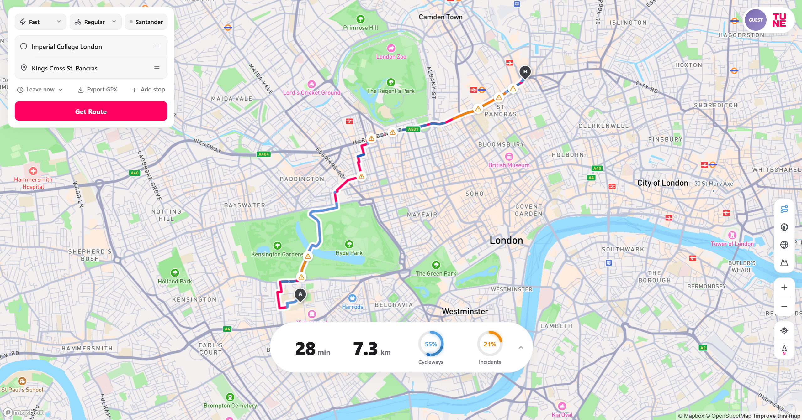

<em>Web planner on Imperial College → King's Cross (Fast). Origin, destination, preset, and bike type sit in the top-left card. The collapsed island at the bottom centre shows duration, length, and cycleway / incident shares.</em>

---

## Architecture

The stack splits into a data pipeline that builds the graph, a main routing server that answers live requests, a debug server for overlay checks, and two planner clients that share the same API.

  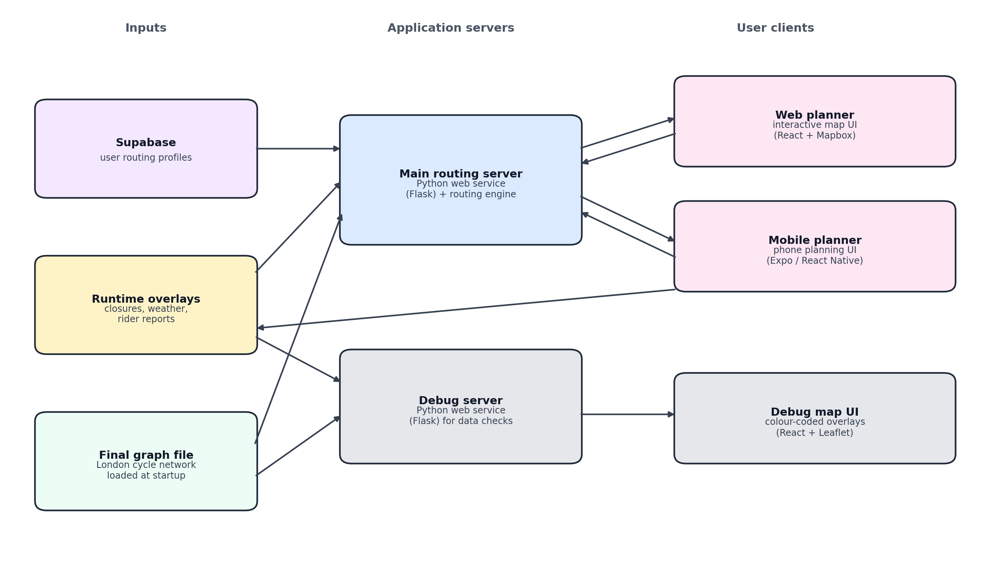

<em>Inputs (graph file, runtime overlays, saved profiles) → Flask servers → web, mobile, and debug clients.</em>

**Data path**

1. A dedicated pipeline turns an OpenStreetMap Greater London extract into a directed, noded cycle graph. STATS19 collisions, Environment Agency LIDAR elevations, park polygons, attractions, and TfL cycle-programme geometries are attached before the graph is written to disk.
2. At process start, the main and debug Flask servers load that graph file into memory (~8 GB resident). Closures, weather, and in-ride reports stay in RAM overlays so they can change without a rebuild.
3. User accounts and saved routing profiles live in [Supabase](https://supabase.com/). Guests can use the three named presets; only signed-in riders can create stored custom profiles.
4. The **web planner** (React + Mapbox) and the **mobile planner** (Expo / React Native) call the same route, geocode, overlay, and profile endpoints. Commercial map services supply the basemap and place search only. Bicycle paths are always this system's A\* result.
5. A second Flask process plus a Leaflet debug map colour-codes graph tags (surfaces, grades, TfL network, barriers, live disruptions) without running the planner UI.

  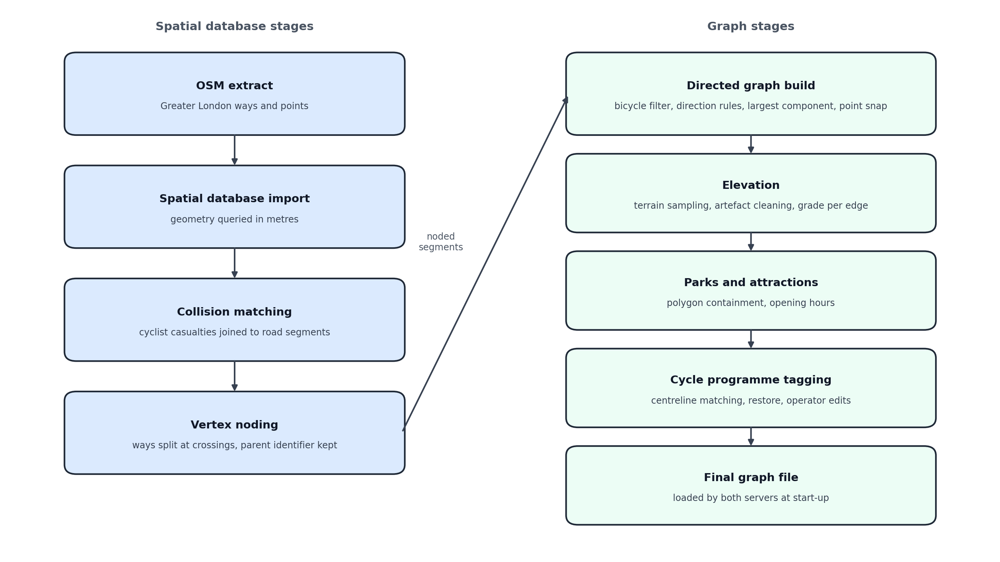

<em>Graph pipeline. Blue: PostGIS stages (import, collision matching, vertex noding). Green: NetworkX stages (directed build, elevation, parks, TfL tagging, final file).</em>

### Tech stack

| Layer | Technology | Role |
| :--- | :--- | :--- |
| Web planner | React, Mapbox GL | Browser map, place search, analysis island, overlays |
| Mobile planner | Expo, React Native, Mapbox (plan), MapLibre (guidance) | Native planning UI and spoken turn-by-turn |
| Debug map | React, Leaflet | Colour-coded tag overlays for pipeline checks |
| Routing server | Flask, NetworkX, Numba A\* | Request-scoped costs, live overlays, profiles |
| Profiles / auth | Supabase | Accounts, JWT sessions, row-level profile storage |
| Graph build | Python, PostgreSQL / PostGIS | OSM ingest, noding, snapping, elevation, TfL tags |

  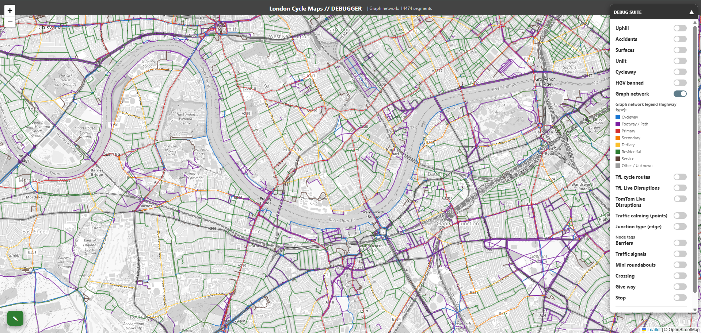

<em>Debug application with the graph-network overlay. Right-click inspection of a segment returns the tags the cost function actually reads.</em>

---

## Web application

The browser planner is the desktop client. Controls float over the map: no full-height sidebar. A rider sets origin and destination (typed search or map tap), chooses a bike type and a preset, then presses **Get Route**. Search starts as soon as both points exist; the path is held until that button so the reveal feels instant.

| Preset | Intent |
| :--- | :--- |
| **Fast** | Direct, low-friction routing. Flow (signals, barriers, calming) wins over long detours. |
| **Safe** | Low-stress routing. Collision history, speed stress, junctions, and vehicular-free infrastructure win when preferences conflict. |
| **Leisure** | Scenic / comfortable rides. Green space and hills matter more; safety still applies where it conflicts. |

### Functions

- **Origin / destination** — place search (proxied through Flask) or tap-to-pin. Snaps onto the Greater London graph; far-off clicks are rejected.
- **Bike type and preset** — cargo, e-bike, road, or standard bike, plus Fast / Safe / Leisure. Bike type changes hill, barrier, and surface behaviour.
- **Custom profiles** — signed-in riders run a four-step wizard (bike → preset → sliders / delay budget → lighting, surface, and infrastructure toggles) and save a named profile.
- **Analysis island** — collapsed: time, distance, and two ring charts. Expanded: elevation profile with total gain, plus stacked bars for incidents, cycleway classes, and attractions. Chart slots follow the active overlay.
- **Overlay rail** — optional colouring of the drawn path (cycleways, attractions, hills, lighting, live incidents, and related layers) without dumping the whole graph onto the map.
- **Santander Cycles** — live TfL BikePoint docks, occupancy, walk estimate to the chosen station, then a cycle leg on this system's graph. Mutually exclusive with depart-at and extra stops.
- **Depart at** — park opening hours evaluated at a future clock. Live traffic and hard closures are left off when the chosen time is more than 30 minutes ahead.
- **Intermediate stops** — up to three extra snaps; A\* runs on each consecutive pair.
- **GPX export** — download the revealed path for a bike computer.
- **First-run tutorial** — highlights one control at a time; can be skipped and reopened.
- **Live incidents** — TfL / TomTom disruptions drawn on the path (yellow triangles in the overview).

  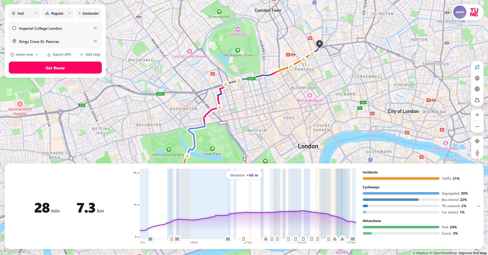

<em>Expanded analysis island: duration and length, elevation with total gain, and composition bars.</em>

  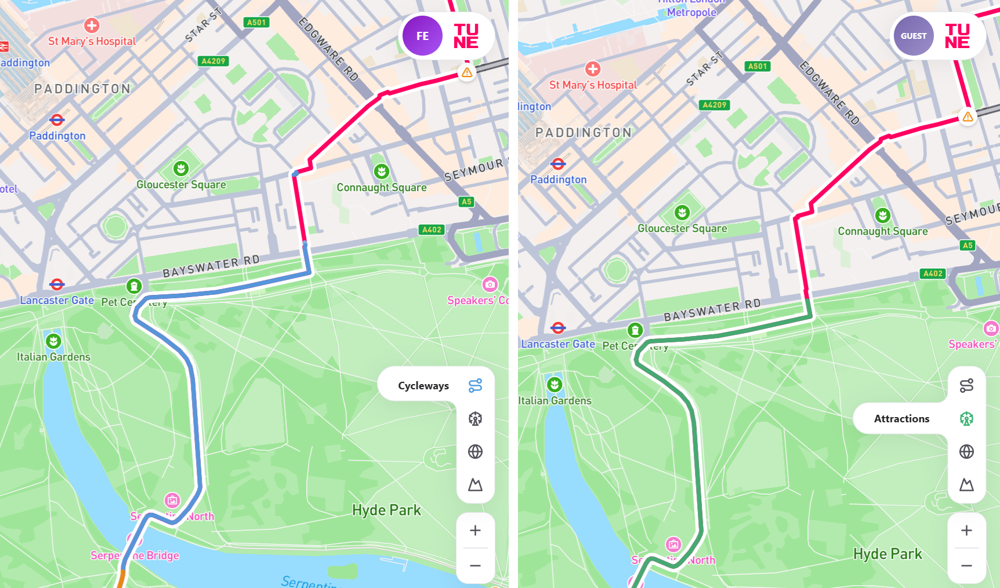

<em>Right-hand overlay rail: cycleways (left) and attractions (right) on the same corridor.</em>

  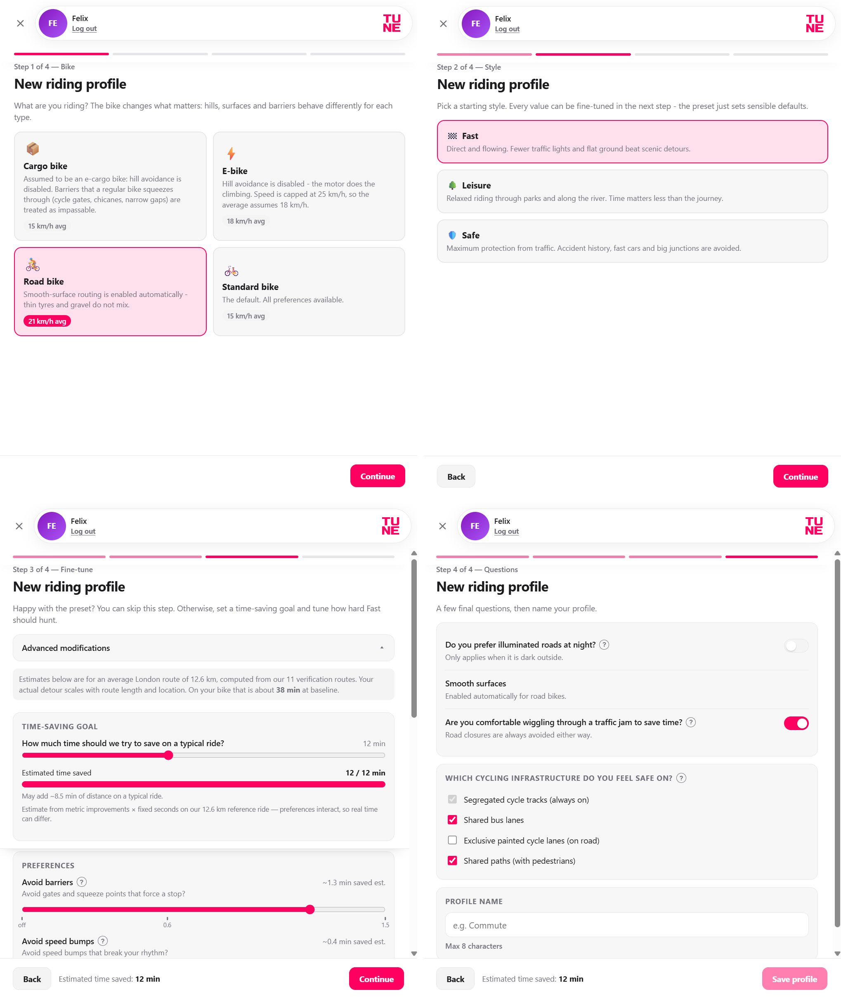

<em>New-profile wizard. Top: bike type and preset. Bottom: delay-budget sliders and lighting / surface / infrastructure toggles.</em>

  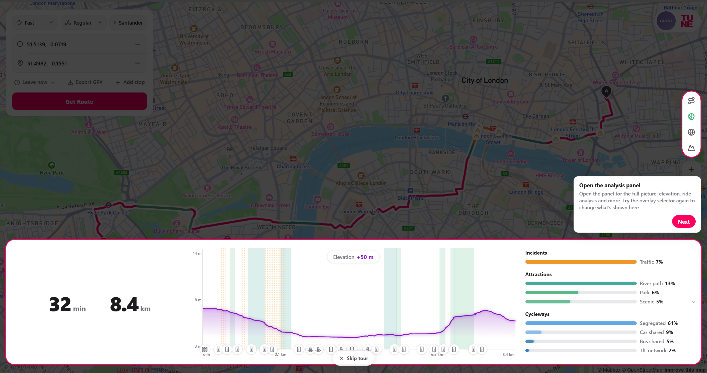

<em>First-run tutorial highlighting the expanded analysis panel.</em>

  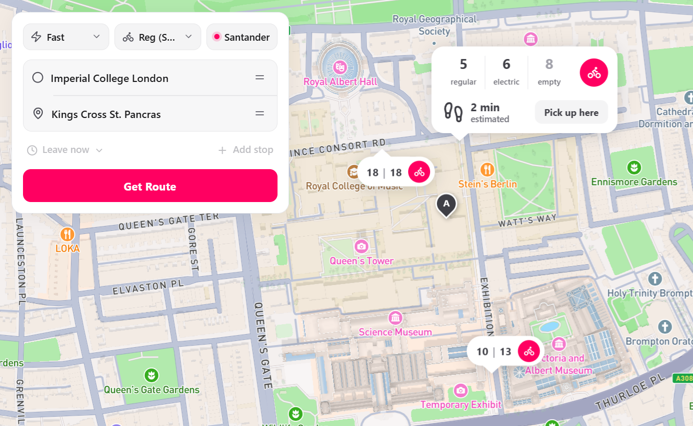

<em>Santander dock selection: station markers with occupancy and a selected-station card (regular / electric bikes, empty docks, walk estimate).</em>

---

## Mobile application

The Expo client ships the same planner onto a phone and calls the same Flask route, profile, and geocode endpoints. Planning still uses Mapbox. Once the rider is moving, guidance switches to MapLibre on this system's geometry (not a second commercial cycle network).

### Functions

- **Same planning surface as the website** — origin / destination, preset, bike type, Santander, depart-at, and extra stops.
- **Three-slide island** — the desktop island is one wide row; the phone splits it into core metrics, elevation, and detailed bars.
- **Turn-by-turn** — next instruction, following-turn preview, remaining time and distance, ETA, voice, and mute. The path, step list, and arrows come from this system's A\* geometry.
- **Off-path replan** — if the marker leaves the path (about 40 m, or heading the wrong way for several seconds), the old line greys and the planner is called from the current location.
- **In-ride reports** — one tap while navigating opens Surface, Danger, Impassable, and Speeding (Unlit after dark). Reports snap to the nearest edge and enter the same RAM overlay as live closures. Impassable replans immediately; other categories affect later routes after corroboration (signed-in riders also keep a personal overlay of their own reports).

  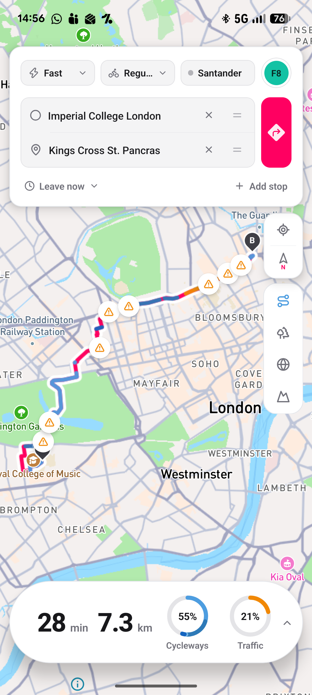
  &nbsp;
  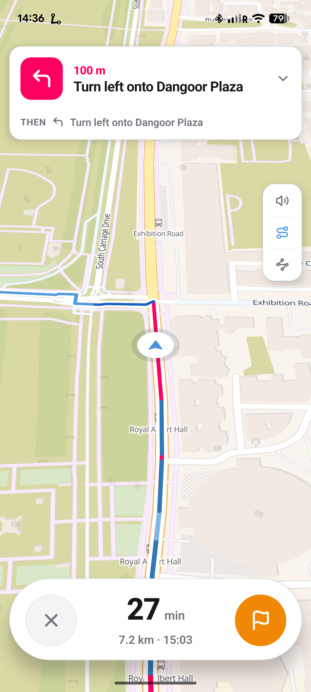
  &nbsp;
  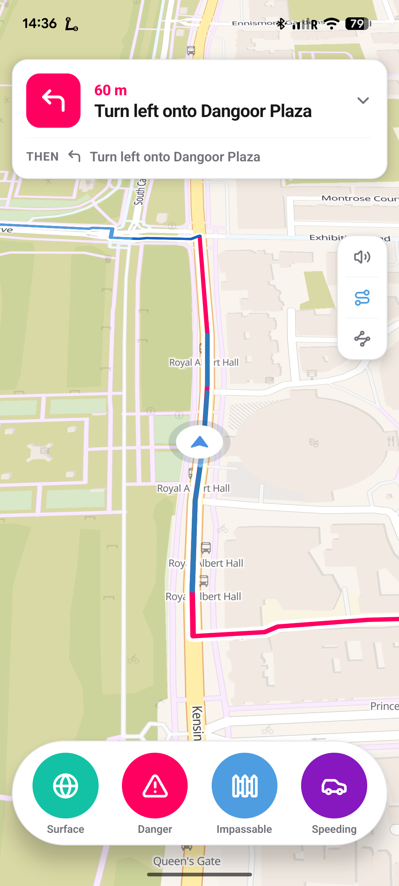

<em>Left: planning screen on Imperial → King's Cross. Centre: turn-by-turn (MapLibre). Right: in-ride report picker (Surface, Danger, Impassable, Speeding).</em>

  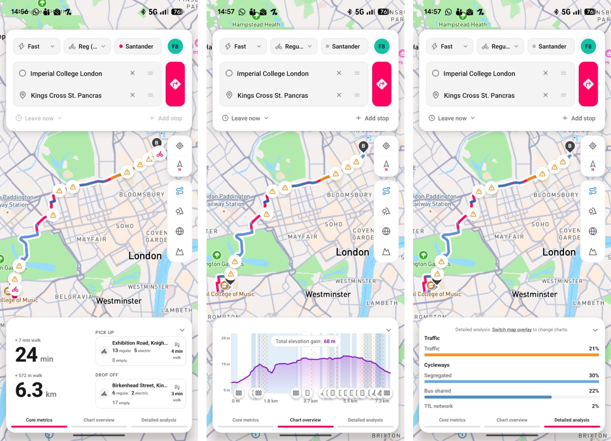

<em>Expanded mobile island as three slides: core metrics (Santander hire trip with pick-up / drop-off cards), elevation, and detailed bars.</em>

---

## Repository layout

| Path | Contents |
| :--- | :--- |
| `3_pipeline/` | Graph construction and I/O |
| `4_backend_engine/` | Main Flask routing server |
| `5_frontend/` | Web planner (`src/v2/` is the customer UI) |
| `8_debug/` | Debug Flask server and Leaflet frontend |
| `9_mobile/` | Expo / React Native client |
| `docs/readme/` | Screenshots used in this README |

Further notes: [`0_documentation/APP_MAIN.md`](0_documentation/APP_MAIN.md), [`0_documentation/APP_DEBUG.md`](0_documentation/APP_DEBUG.md), [`0_documentation/GRAPH.md`](0_documentation/GRAPH.md).

Third-party map, search, and disruption features need API credentials in local environment files (not committed).
